# Alertmanager to Notion Integration (via Google Cloud Function Gen2)

[](https://codecov.io/github/CthtufsPetProjects/alertmanager-to-notion)

A solution for integrating Prometheus Alertmanager with Notion databases using Google Cloud Functions (Gen2). This project provides a robust structure for processing Alertmanager webhooks, publishing events to Google Cloud Pub/Sub, and handling those events to manage alert records in Notion.

## Description

This project offers a streamlined approach to persist and manage Prometheus alerts within a Notion database. It leverages Google Cloud Functions Gen2 for event processing, ensuring scalability and cost-efficiency. The architecture is designed for clear separation of concerns: an HTTP-triggered function acts as a webhook receiver, and a Pub/Sub-triggered function processes the alert data for Notion interaction. If you don't need Google Cloud Function implementation, you can take the core logic class [NotionService](app/services/notion.py) to your own project.

### Why This Project Was Created

I'm building an ITSM framework based on Notion, for startups and small companies, which includes an incident management subsystem. A key requirement was to automatically create incident records in a Notion database when incidents occurs in a Prometheus monitoring system. Also, it's critical to update these records in Notion automatically once an incident is resolved.

This automation helps to:
1. Log incidents instantly, saving time on manual entry.
2. Maintain a single source of truth for all incidents directly in Notion.
3. Speed up incident resolution with always-current information.
4. Focus on fixing problems, not on administrative tasks.

## Use Case Example

This template is specifically adapted for the following use case:

1.  **Alertmanager Webhook Reception (HTTP Request Handling):**
    * An **HTTP-triggered Google Cloud Function** acts as the endpoint for Prometheus Alertmanager webhooks.
    * Upon receiving an alert notification (firing or resolved), this function processes the HTTP request.

2.  **Event Publishing to Pub/Sub:**
    * The HTTP-triggered function, after initial processing of the Alertmanager webhook, **publishes the alert event as a message to a Google Cloud Pub/Sub topic.** This decouples the webhook reception from the Notion interaction, making the process more resilient and scalable.

3.  **Pub/Sub Event Processing (Queue Event Handling):**
    * A **Pub/Sub-triggered Google Cloud Function** (the "worker") subscribes to the Pub/Sub topic.
    * When an alert event is received via Pub/Sub, this worker function performs the core logic:
        * It determines if an event with the specific `fingerprint` (unique identifier of the alert) already exists in the configured Notion database.
        * If an event with the `fingerprint` is found, it **updates the `Resolved` field (e.g., `true`/`false`)** for that Notion record.
        * If no existing record with the `fingerprint` is found, a **new entry (row) is created** in the Notion database.

---

## Installation

1.  **Install the required tools:**
    * [pyenv](https://github.com/pyenv/pyenv) for managing Python versions.
    * [Poetry](https://python-poetry.com/) for dependency management.

2.  **Clone the repository:**
    ```bash
    git clone [https://github.com/CthtufsPetProjects/your-new-repo-name.git](https://github.com/CthtufsPetProjects/your-new-repo-name.git) # Update with your repo URL
    ```

3.  **Navigate to the project directory:**
    ```bash
    cd your-new-repo-name # Update with your repo name
    ```

4.  **Install dependencies:**
    ```bash
    poetry install
    ```

5.  **Init development:**
    This command creates `.env` file and Docker Compose configuration from templates, and installs pre-commit hooks.
    ```bash
    make init_development
    ```

---

## CI Setup

To enable CI/CD pipelines, follow these steps:

1.  Add the following secrets to your GitHub Actions:
    * **GCP_PROJECT_ID** – Your Google Cloud project ID.
    * **GCP_REGION** – The Google Cloud region where the functions will be deployed.
    * **GCP_SA_KEY** – Service Account key JSON (Get content for this secret from file `config/ghsa.json`).
    * **NOTION_API_KEY** – Your Notion integration token.
    * **NOTION_DATABASE_ID** – The ID of your Notion database for alerts.

2.  For test coverage metrics:
    * Register your project on [Codecov](https://app.codecov.io/).
    * Obtain the **CODECOV_TOKEN** for your project and add it to GitHub secrets.

---

## Usage

1.  Create a Notion integration and database:
    * [Create a Notion integration](https://www.notion.so/profile/integrations) and get your API key.
    * [Duplicate Incident Management template](https://notion.so)
    * Add the integration to your database with full access permissions. (Go to your database page, click "..." at the top right, select "Connections", and choose your integration.)
    * [Get the database ID](https://developers.notion.com/reference/retrieve-a-database).
2.  Create a Google Cloud project and get your Project ID.
3.  Fill variables in the `terraform.tfvars` file (create from `terraform.tfvars.template`).
    ```bash
    cp infra/terraform.tfvars.template infra/terraform.tfvars
    ```
    Ensure you specify your Notion API key and database ID here for Terraform to provision environment variables for your Cloud Functions.
4.  Deploy the infrastructure:
    ```bash
    terraform -chdir=infra init
    terraform -chdir=infra apply
    ```
    *Note*: I suggest to keep terraform state in the repository for simplicity during development. For production, use a remote state.
5.  Setup CI (see the [CI Setup](#ci-setup) section).
6.  Commit changes and push to your repository.
7.  Create a Pull Request (PR) and check its status.
8.  Merge the PR to the `main` branch.
9.  Check the GitHub Actions tab for the CI/CD pipeline status to confirm deployment.

---

## Contribution

Community contributions are warmly welcomed! Please create pull requests or open issues to discuss suggestions and improvements.

---

## License

This project is distributed under the MIT License. See the [LICENSE](LICENSE) file for details.

---

## Diagrams

### Main Flow

